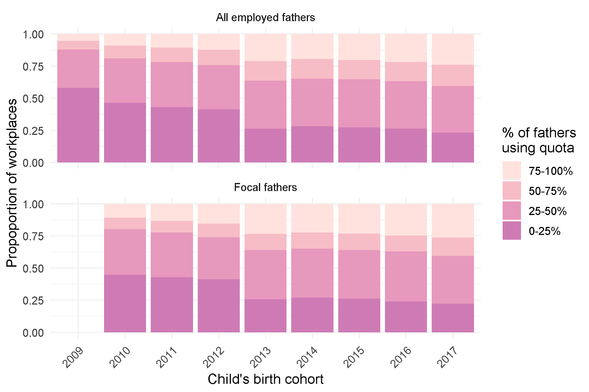

Codes and data descriptives for *Heterogeneous workplace peer effects in
fathers’ parental leave uptake in Finland*
================

- File `sample_data_construction.R` contains the code used to create the
  data for the modelling, based on the full sample created in
  `full_data_construction.R`. The source data is only accessible via
  Statistics Finland’s remote access system
  [FIONA](https://stat.fi/tup/tutkijapalvelut/fiona-etakayttojarjestelma_en.html).
  Data description is available at [INVEST Data
  Catalog](https://investdata.utu.fi/catalog) (INVEST Data (e17)).
- File `model_estimation.R` contains the codes for estimating the main
  model of the paper, using the Stan model in `model.stan`.
- Files `model_estimation_from_2013.R` and
  `model_estimation_timegap_restriction.R` contain the codes for the
  models using the limited data of the robustness checks of the
  supplementary materials.
- File `causal_effects.R` was be used to compute the causal effect
  estimates, and `figures.R` was used to create the figures of the paper
  and supplementary material.

## Industry classification

Whilst the TOL 2008 classification scheme is useful for cross-country
comparisons, some of the classifications are inappropriate groupings for
our study question. As such, we used the following reclassification,
where characters and numbers in square brackets correspond to the
original TOL 2008 values:

1.  Agriculture, forestry and fishing \[A\]
2.  Mining and quarrying \[B\]
3.  Manufacturing \[C\]
4.  Electricity, gas, steam and air con supply \[D\]
5.  Water supply; sewerage, waste management and remediation activities
    \[E\]
6.  Construction \[F; excluding 432, 433, 4391 (see 7 for details)\]
7.  “Home labourers”, containing electrical, plumbing and other
    construction installation activities \[432\], building completion
    and finishing \[433\], and roofing activities \[4391\]. These were
    separated from construction as they are the fields that homeowners
    can make use of.
8.  Wholesale and retail trade \[G\]
9.  Transportation (freight) and storage \[H, excluding 491, 493, 501,
    503, and 511 (see 10)\]
10. Transportation (passenger), containing train \[491\], other land
    \[493\], sea/coast \[501\], inland water \[503\], and air \[511\].
    Freight and passenger transportation were separated as the nature of
    the work differs substantially. Whilst some occupations will be
    similar across the same type of transport (e.g. train), there are
    also occupations that are found in passenger but not freight and
    vice versa.
11. Accommodation \[55\]. Separated from I - Accommodation and food
    service activities.
12. Food service activities \[56\]. Separated from I - Accommodation and
    food service activities.
13. Information and publishing \[J\]
14. Financial and insurance activities \[K\]
15. Real estate activities \[L\]
16. Legal and accounting \[69\]. Separated from M - Professional,
    scientific and technical activities.
17. Activities of head offices; management consultancy \[70\]. Separated
    from M - Professional, scientific and technical activities.
18. Architecture and engineering \[71\]. Separated from M -
    Professional, scientific and technical activities.
19. Scientific research and development \[72\]. Separated from M -
    Professional, scientific and technical activities.
20. Advertising and market research \[73\]. Separated from M -
    Professional, scientific and technical activities.
21. Other professional activities \[74\]. Separated from M -
    Professional, scientific and technical activities. This category is
    still broad and encompasses professional activities that don’t group
    together particularly well but also are too specific to be
    standalone industries, such as specialised design, photography
    (ranging from taking photographs to processing in a red room),
    translation and interpretation, and weather forecasting, among many
    others.
22. Veterinary activities \[75\]. Separated from M - Professional,
    scientific and technical activities.
23. Administrative and support service activities \[N\]
24. Administration of state, including administration of the State and
    the economic and social policy of the community \[841\], foreign
    affairs \[8421\], and compulsory social security activities \[843\].
    Separated from O - Public administration and defence.
25. Provision of services to the community as a whole \[842\], excluding
    8421 (see 24) and 8422 (see 26). Separated from O - Public
    administration and defence. This category includes frontline
    services such as police and border guard, fire services, and
    judicial services.
26. Defence activities \[8422\]. Separated from O - Public
    administration and defence.
27. Education \[P\]
28. Human health activities \[86\]. Separated from Q – Human health and
    social work activities.
29. Social work activities, including residential care activities \[87\]
    and social work activities without accommodation \[88\]. Separated
    from Q - Human health and social work activities.
30. Creative, arts and entertainment \[90\]. Separated from R – Arts,
    entertainment and recreation.
31. Libraries, archives, museums and other cultural attractions \[91\].
    Separated from R – Arts, entertainment and recreation.
32. Sports activities \[931\]. Separated from R - Arts, entertainment
    and recreation.
33. Other, including other service activities \[S\], amusement and
    recreation \[932, separated from R - Arts, entertainment and
    recreation\], gambling and betting \[92, separated from R - Arts,
    entertainment and recreation\], activities of households as
    employers and undifferentiated goods and services providers \[T\],
    and activities of extraterritorial organisations \[U\]. This
    ‘industry’ is very broad, encompassing all subclassifications that
    are not large enough to be considered as separate industries for the
    purposes of this study, but are also not suited to being included
    within other industries.

### Descriptive statistics

| Focal father’s quota use | Peer’s quota use |          | Focal father’s education |                 |                |                |
|--------------------------|------------------|----------|--------------------------|-----------------|----------------|----------------|
|                          | Quota            | No quota | Basic                    | Upper secondary | Lower tertiary | Upper tertiary |
| Any quota (%)            |                  |          |                          |                 |                |                |
|   2010-2012              | 48.5             | 29.3     | 20.5                     | 29.1            | 47.9           | 57.8           |
|   2013-2017              | 57.8             | 42.7     | 34.3                     | 45.3            | 58.5           | 65.5           |
| Duration, all            |                  |          |                          |                 |                |                |
|   2010-2012              | 18               | 18       | 18                       | 18              | 18             | 41             |
|   2013-2017              | 36               | 18       | 18                       | 18              | 36             | 44             |
| Duration, leave users    |                  |          |                          |                 |                |                |
|   2010-2012              | 36               | 18       | 18                       | 18              | 34             | 45             |
|   2013-2017              | 42               | 18       | 18                       | 24              | 41             | 48             |
| Duration, quota users    |                  |          |                          |                 |                |                |
|   2010-2012              | 54               | 54       | 54                       | 54              | 54             | 54             |
|   2013-2017              | 54               | 43       | 53                       | 53              | 53             | 54             |

Proportions of focal fathers in the sample taking quota and leave
durations (in total) by peer leave status and focal father’s education
level. Leave durations are median number of leave days for all fathers,
those taking any leave (minimum 1 day of leave), and those taking at
least some of the quota (minimum 19 days of leave).

|                       | All fathers | Employed fathers | All focal fathers | First-time focal fathers | Multiparous focal fathers |
|-----------------------|-------------|------------------|-------------------|--------------------------|---------------------------|
| Any leave uptake (%)  |             |                  |                   |                          |                           |
|   2009                | 73.9        | 80.3             | \-                | \-                       | \-                        |
|   2010-2012           | 75.4        | 81.9             | 86.8              | 87.4                     | 86.4                      |
|   2013-2017           | 76.1        | 83.8             | 88.0              | 88.9                     | 87.3                      |
| Quota uptake (%)      |             |                  |                   |                          |                           |
|   2009                | 22.1        | 25.5             | \-                | \-                       | \-                        |
|   2010-2012           | 30.6        | 33.8             | 35.3              | 39.2                     | 32.2                      |
|   2013-2017           | 42.9        | 48.7             | 49.1              | 53.3                     | 45.9                      |
| Duration, leave users |             |                  |                   |                          |                           |
|   2009                | 18          | 18               | \-                | \-                       | \-                        |
|   2010-2012           | 18          | 18               | 18                | 18                       | 18                        |
|   2013-2017           | 33          | 35               | 32                | 37                       | 27                        |
| Duration, quota users |             |                  |                   |                          |                           |
|   2009                | 42          | 42               | \-                | \-                       | \-                        |
|   2010-2012           | 54          | 54               | 54                | 54                       | 54                        |
|   2013-2017           | 54          | 54               | 53                | 53                       | 53                        |

Descriptive information about parental leave uptake for children born in
Finland from April 2008 to December 2017 for all fathers, employed
fathers, and focal fathers in the sample (distinguishing between all,
first-time, and multiparous focal fathers). Durations are median number
of days for all leave users and quota users. Note that before 2010, the
maximum quota length was 42 days.

|             | 1–9   | 10–49 | 50–249 | 250+  |
|-------------|-------|-------|--------|-------|
| Workplaces  |       |       |        |       |
|   2009      | 0.394 | 0.409 | 0.157  | 0.039 |
|   2010-2012 | 0.501 | 0.377 | 0.101  | 0.020 |
|   2013-2017 | 0.521 | 0.372 | 0.090  | 0.017 |
| Fathers     |       |       |        |       |
|   2009      | 0.201 | 0.285 | 0.235  | 0.275 |
|   2010-2012 | 0.212 | 0.291 | 0.230  | 0.268 |
|   2013-2017 | 0.209 | 0.312 | 0.235  | 0.244 |

Proportions of workplaces and employed fathers by the total number of
employees in the workplace. {#tbl-descWP}

|                 | Any leave (%) | Quota (%) | Mean N | Median N | Male (%) |
|-----------------|---------------|-----------|--------|----------|----------|
| All fathers     |               |           |        |          |          |
|   2009          | 78.9          | 20.8      | 63.8   | 14       | 74.7     |
|   2010-2012     | 80.1          | 28.9      | 61.4   | 13       | 75.6     |
|   2013-2017     | 82.8          | 43.1      | 62.2   | 14       | 75.9     |
| Sampled fathers |               |           |        |          |          |
|   2010-2012     | 82.6          | 28.8      | 31.2   | 18       | 77.8     |
|   2013-2017     | 82.9          | 42.7      | 25.2   | 13       | 77.5     |

Descriptive statistics about workplaces for all fathers and sampled
fathers: Average proportion of eligible fathers taking any parental
leave or father’s quota, mean and median number of employees, and
average share of male employees.

| Variable                                             | n (%) or median (SD) |
|------------------------------------------------------|----------------------|
| 2013 reform                                          |                      |
|   Not eligible                                       | 44,506 (36%)         |
|   Eligible                                           | 80,447 (64%)         |
| Timing of previous own child                         |                      |
|   No earlier child                                   | 53,393 (43%)         |
|   Birth before 2009                                  | 42,751 (34%)         |
|   No quota, not eligible to 2013 reform, before peer | 10,912 (8.7%)        |
|   No quota, not eligible to 2013 reform, after peer  | 2,110 (1.7%)         |
|   Quota, not eligible to 2013 reform, before peer    | 5,396 (4.3%)         |
|   Quota, not eligible to 2013 reform, after peer     | 1,040 (0.8%)         |
|   No quota, eligible to 2013 reform, before peer     | 2,978 (2.4%)         |
|   No quota, eligible to 2013 reform, after peer      | 1,382 (1.1%)         |
|   Quota, eligible to 2013 reform, before peer        | 3,628 (2.9%)         |
|   Quota, eligible to 2013 reform, after peer         | 1,363 (1.1%)         |
| Occupation                                           |                      |
|   Unknown                                            | 5,900 (4.7%)         |
|   Managers                                           | 2,801 (2.2%)         |
|   Professionals                                      | 23,381 (19%)         |
|   Technicians and associate professionals            | 18,361 (15%)         |
|   Clerical support workers                           | 2,428 (1.9%)         |
|   Service and sales workers                          | 11,459 (9.2%)        |
|   Skilled agricultural, forestry and fishery workers | 459 (0.4%)           |
|   Craft and related trades workers                   | 33,940 (27%)         |
|   Plant and machine operators, and assemblers        | 21,145 (17%)         |
|   Elementary occupations                             | 5,079 (4.1%)         |
| Education                                            |                      |
|   Basic                                              | 15,476 (12%)         |
|   Upper Secondary                                    | 69,003 (55%)         |
|   Lower tertiary                                     | 25,528 (20%)         |
|   Higher tertiary                                    | 14,946 (12%)         |
| Partner’s education                                  |                      |
|   Basic                                              | 12,786 (10%)         |
|   Upper Secondary                                    | 55,763 (45%)         |
|   Lower tertiary                                     | 36,235 (29%)         |
|   Higher tertiary                                    | 20,169 (16%)         |
| Partner’s education compared to focal father         |                      |
|   Lower                                              | 21,830 (17%)         |
|   Same                                               | 63,291 (51%)         |
|   Higher                                             | 39,832 (32%)         |
| Peer’s education compared to focal father            |                      |
|   Lower                                              | 25,484 (20%)         |
|   Same                                               | 75,228 (60%)         |
|   Higher                                             | 24,241 (19%)         |
| Partner’s income compared to focal father            |                      |
|   Lower or same                                      | 102,845 (82%)        |
|   Higher                                             | 22,108 (18%)         |
| Peer used quota                                      | 48,915 (39%)         |
| Age (years)                                          | 32 (5.8)             |
| Partner’s age (years)                                | 30 (5.1)             |
| Age gap (months) of the peer’s and focal’s child     |                      |
|   0-3                                                | 28,256 (23%)         |
|   3-6                                                | 18,514 (15%)         |
|   6-9                                                | 13,477 (11%)         |
|   9-12                                               | 10,347 (8.3%)        |
|   12-15                                              | 8,328 (6.7%)         |
|   15-18                                              | 6,859 (5.5%)         |
|   18-21                                              | 5,602 (4.5%)         |
|   21-24                                              | 4,805 (3.8%)         |
|   24-27                                              | 3,859 (3.1%)         |
|   27-30                                              | 3,313 (2.7%)         |
|   30-33                                              | 2,753 (2.2%)         |
|   33-36                                              | 2,495 (2.0%)         |
|   36-39                                              | 2,064 (1.7%)         |
|   39-42                                              | 1,793 (1.4%)         |
|   42-45                                              | 1,624 (1.3%)         |
|   45-48                                              | 1,449 (1.2%)         |
|   48+                                                | 9,415 (7.5%)         |
| Peer not eligible to 2010 reform                     | 17,683 (14%)         |
| Peer eligible to 2010 reform                         | 52,154 (42%)         |
| Peer eligible to 2013 reform                         | 55,116 (44%)         |
| Share of male employees in the workplace             | 0.87 (0.21)          |
| Number of employees in the workplace                 | 34 (51.37)           |
| Logarithm of the number of employees                 | 3.53 (1.11)          |
| Past leave takers before the peer                    |                      |
|   0                                                  | 72,424 (58%)         |
|   1                                                  | 21,835 (18%)         |
|   2-4                                                | 20,343 (16%)         |
|   5+                                                 | 10,351 (8%)          |

Descriptive statistics of variables used in the model: For categorical
variables, number of observations and proportions; median and standard
deviation for the others.

<figure>

<figcaption aria-hidden="true">Annual proportion of workplaces in the
data of all employed fathers and sampled fathers, categorized by the
percentage of fathers using the quota. Each category includes the right
value but excludes the left, except for the 0-0.25 category, which also
includes 0. Lighter colors signify a higher proportion of fathers in the
workplace who used the quota. Inclusion in this figure required a
minimum of 2 fathers per workplace per year. </figcaption>
</figure>

